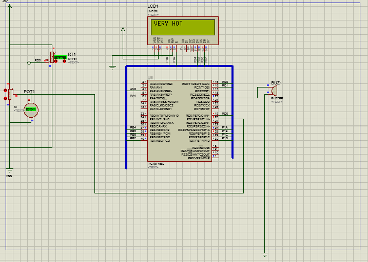

# fire-alarm-system-using-pic-18-and-thermocouple-sensor

The above shows the wiring for this system. A LCD display is used to show the temperature state of the surrounding. There is also a buzzer
that gets activated whenevr the thermocouple senses that the temperature goes above the threshold value. 
